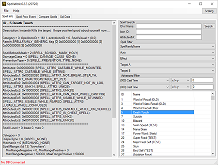

SpellWork
=========

SpellWork is a tool to browse and display information about World of Wacraft spells.
It is implemented in .NET and it runs on Windows and Linux (with Mono).

Instructions: Run `SpellWork.exe` and select the DBC folder extracted from the client (e.g. by running TrinityCore's `map_extractor`).

Nightly Builds & Downloads
--------------------------

- [**1.12.1 / 1.12.2** (branch 0.6)](https://ci.appveyor.com/api/projects/DDuarte/spellwork-cs/artifacts/SpellWork/SpellWork.zip?job=Configuration:%20Release&branch=0.6)

- [**2.4.3 (8606)** (branch 0.12)](https://ci.appveyor.com/api/projects/DDuarte/spellwork-cs/artifacts/SpellWork/SpellWork.zip?job=Configuration:%20Release&branch=0.12)

- [**3.3.5a (12340)** (branch master)](https://ci.appveyor.com/api/projects/DDuarte/spellwork-cs/artifacts/SpellWork/SpellWork.zip?job=Configuration:%20Release&branch=master)

- [**4.0.3 (13117)** (branch 400)](https://ci.appveyor.com/api/projects/DDuarte/spellwork-cs/artifacts/SpellWork/SpellWork.zip?job=Configuration:%20Release&branch=400)

- [**4.3.4 (15595)** (branch 4.3.4)](https://ci.appveyor.com/api/projects/DDuarte/spellwork-cs/artifacts/SpellWork/SpellWork.zip?job=Configuration:%20Release&branch=4.3.4)

- [**5.4.8 (18414)** (branch 5.4.8)](https://ci.appveyor.com/api/projects/DDuarte/spellwork-cs/artifacts/SpellWork/SpellWork.zip?job=Configuration:%20Release&branch=5.4.8)

- [**6.2.3 (20726)** (branch 6.x)](https://ci.appveyor.com/api/projects/DDuarte/spellwork-cs/artifacts/SpellWork/SpellWork.zip?job=Configuration:%20Release&branch=6.x)

- [**7.1.5 (23360)** (branch 7.x)](https://ci.appveyor.com/api/projects/DDuarte/spellwork-cs/artifacts/SpellWork/SpellWork.zip?job=Configuration:%20Release&branch=7.x)

History
-------

SpellWork is a tool originally created by Chestr (also known as DiSlord).

This project is a try to rebuild the application using C#.

Thanks goes to:

- Chestr (for the idea and released source of original spell_work)
- TOM_RUS (for code samples)
- Shauren (updating for TrinityCore)
